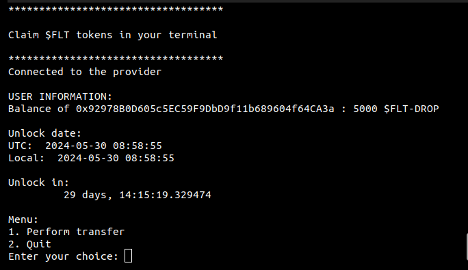

# flt-tokens-claim

Claim your $FLT tokens with this script.
To claim $FLT, you have to transfer you have to transfer your $FLT-DROP

## Features:
- View how many $FLT-DROP you have
- View in how many times you can claim
- Transfer $FLT-DROP to yourself and receive $FLT

## Configuration
Create environment variables:
- ``PRIVATE_KEY`` (Your private key, used to claim tokens)

[//]: # (- ``HTTP_PROVIDER_URL`` &#40;the url to the http provider &#40;influra, blaspi, alchemy...&#41;&#41;)

Set ``http_provider_url`` in ``main.py`` with the HTTP address of your Ethereum provider (influra, alchemy, blastapi ect..)

> The ``http_provider_url`` is default set to public RCP endpoint of blastapi

> On Unix to create an environment variable: ``$ YOUR_VARIABLE=YOUR_VALUE``

## Contributing

Thanks for your help improving the project! 

Feel free to open issue / create pull requests!

## Credits
This script would not have been possible without the great work done in:
- [flt-withdraw of XdpCs](https://github.com/XdpCs/flt-withdraw/)

## License
This script is licensed under the MIT License.